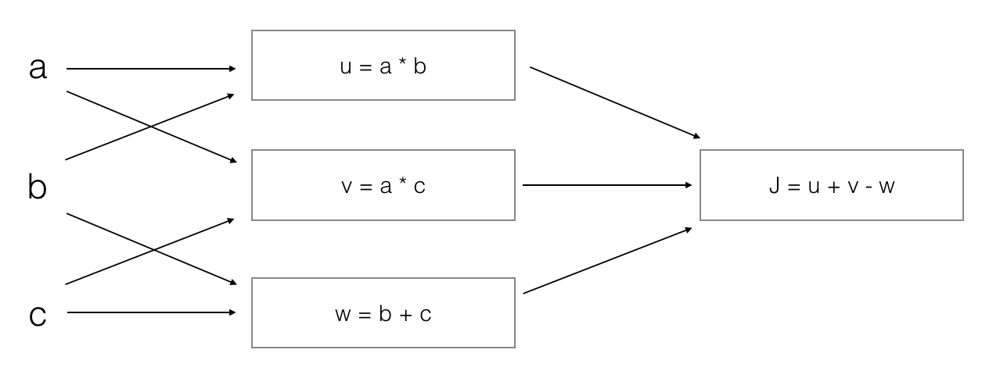

1. What does a neuron compute?
    - [ ] A neuron computes a function g that scales the input x linearly (Wx + b)
    - [x] A neuron computes a linear function (z = Wx + b) followed by an activation function
    - [ ] A neuron computes the mean of all features before applying the output to an activation function
    - [ ] A neuron computes an activation function followed by a linear function (z = Wx + b)

2. Which of these is the "Logistic Loss"?
   - [x] ${L}^{(i)}(\hat{y}^{(i)}, y^{(i)}) = -( y^{(i)}\log(\hat{y}^{(i)}) + (1- y^{(i)})\log(1-\hat{y}^{(i)})$
   - [ ] ${L}^{(i)}(\hat{y}^{(i)}, y^{(i)}) = max(0, y^{(i)}-\hat{y}^{(i)})$
    - [ ] ${L}^{(i)}(\hat{y}^{(i)}, y^{(i)}) = |y^{(i)}-\hat{y}^{(i)}|^2$
    - [ ] ${L}^{(i)}(\hat{y}^{(i)}, y^{(i)}) = |y^{(i)}-\hat{y}^{(i)}|$

